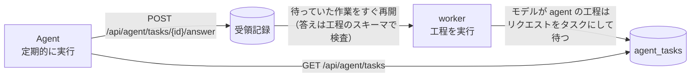

# Agent による処理

モデルの工程（予備選別、2 回の採点、構造化、タイトルと要約、出来事のまとめ、まとめ文、週報・月報の総括、全文翻訳）は、モデルの API の代わりに **Agent** に任せられます。Agent は定期的にサイトの作業のインターフェースへ作業を取りに来て、1 件ずつ答えて送り返します。API キーも従量課金も要りません。Claude Code、Codex CLI、Gemini CLI など、HTTP を呼べてプロンプトに従える Agent なら何でも使えます。



## しくみ

- 工程のモデルが `agent` のとき、worker はモデルを呼ばず、プロンプト、入力、出力の形式（JSON Schema）をそのまま 1 件の**タスク**として保存し、その記事の処理を待たせます。待ちは失敗ではなく、再試行の回数にも数えません。
- Agent の答えは API の答えと同じく**受領記録**に保存され、待っていた作業はすぐに次の工程へ進みます。答えは工程の元のスキーマで検査し、使えなければ理由を添えて同じタスクを出し直します（`retryNote`）。
- 1 本の記事は 3〜4 回の行き来で判断まで進みます：予備選別 → 2 回の採点と構造化（3 件を同時に出す）→ タイトルと要約 → 出来事のまとめ（近い報道があるとき）→ まとめ文。Agent は 1 回の実行の中でタスクがなくなるまで取り直すので、その実行のうちに先の工程まで進みます。
- 1 日（または処理間隔の 3 倍の長いほう）答えのないタスクは取り下げ、待っている工程が次の試行で出し直します。工程のモデルを API に替えた後に残ったタスクは、取り下げで消えます。

## 有効にする

1. **トークン**：`.env` の `AGENT_TOKEN` に 16 文字以上のランダムな文字列を入れます（`node scripts/init-env.ts` は自動で作ります）。設定しなければ作業のインターフェースはすべて `401` を返します。
2. **処理方式**：`site/models.ts` の `PROCESSING.mode`（いまは `agent`）が既定です。環境変数 `PROCESSING_MODE`（`agent` / `api`）と管理画面の「モデル」ページの「処理方式」がこれより優先します。工程ごとに選んだモデル（管理画面、`PREFILTER_MODEL` などの環境変数）は処理方式より優先するので、「採点だけ API」のような組み合わせもできます。
3. **安全弁**：タスクを外に出すことも「モデルの呼び出し」なので、`MODEL_CALLS_ENABLED=true` が必要です。
4. **Agent の実行**を定期的に組みます（下の例）。間隔は管理画面の「モデル」ページで設定し（既定 60 分、5〜1440 分）、作業のインターフェースが Agent に伝えます。Agent 自体の予定（cron など）もこの間隔に合わせてください。

## 作業のインターフェース

すべて `Authorization: Bearer <AGENT_TOKEN>` が必要で、`Cache-Control: no-store` を返します。

### タスクを取る

```
GET /api/agent/tasks?limit=10
```

`limit` は 1〜50（既定 10）。待っているタスクを古い順に返し、返したタスクは 30 分のあいだその Agent のものになります（ほかの実行には渡さない）。30 分を過ぎて答えのないタスクは、次に取りに来た Agent に渡ります。

```json
{
  "intervalMinutes": 60,
  "waiting": 23,
  "instructions": ["各タスクは 1 回のモデル呼び出しです。……"],
  "tasks": [
    {
      "id": 1842,
      "purpose": "score_article",
      "step": "厳選の採点（独立した 2 回の採点、情報源の格付けごとのしきい値）",
      "subject": "article:abc123@1",
      "attempt": "score-1",
      "format": "json",
      "system": "……採点の基準（industry/prompts/selection-score.md）……",
      "input": "システムのルールに従って、次の 1 本の材料が表す出来事を評価する。……",
      "schema": { "type": "object", "properties": { "attentionScore": { "type": "integer" } } },
      "temperature": 0.2,
      "maxTokens": 1024,
      "retryNote": null,
      "postedAt": "2026-10-05T01:02:03.000Z",
      "claims": 1
    }
  ]
}
```

| 項目 | 内容 |
|---|---|
| `system`・`input` | API に送るはずだった指示と入力。そのまま読みます |
| `format` | `json`：JSON オブジェクト 1 つで答える（`schema` があればそれに従う）。`text`：指示が求める形式の文字列で答える（タイトルと要約の工程など） |
| `subject`・`attempt` | 何についてのタスクか。subject と purpose が同じで attempt が違うタスク（2 回の採点）は、**互いを見ずに別々に答えます** |
| `retryNote` | 前回の答えが使えなかった理由。直して答えます |
| `temperature`・`maxTokens` | API で使うはずだった値。答えの長さと揺らぎの目安です |
| `waiting` | この取得の後、誰も持っていない待ちのタスクの数 |

### 答えを送る

```
POST /api/agent/tasks/{id}/answer
Content-Type: application/json

{ "output": { "attentionScore": 82 } }
```

`format` が `text` のタスクは `"output": "title: ……\nsummary: ……"` のように文字列で送ります。`{"ok": true}` を返します。

| 状態 | 意味 |
|---|---|
| `400` | `output` が空、または 20 万文字を超える |
| `404` | そのタスクは待っていない（すでに答えた、取り下げた、存在しない） |

答えの形式の検査は、待っていた工程が次の試行で行います。使えない答えは `200` で受け取った後、理由付きで同じ `id` のタスクとして戻ってきます。

### 状態を見る

```
GET /api/agent/status
```

`{"mode": "agent", "intervalMinutes": 60, "waiting": 23, "claimed": 10, "oldestAt": "…", "answeredDay": 412}` を返します。管理画面の「モデル」ページにも同じ数字が出ます。

## 1 回の実行の流れ

1. `GET /api/agent/tasks?limit=10` で取ります。
2. 1 件ずつ `system` を指示、`input` を入力として答え、`POST …/answer` で送ります。2 回の採点は別々の文脈（サブエージェントなど）で答えます。
3. 1 に戻ります。答えを送ると数秒〜1 分で次の工程のタスクができるので、タスクが空になったら 60 秒ほど待ってもう一度取り、**3 回続けて空なら終わります**。
4. 1 回の実行の時間に上限を決めておき（例：50 分）、超えたら途中でも終わります。持っていたタスクは 30 分後にほかの実行へ渡ります。

## 定期実行の例

### Agent に渡すプロンプト

```text
あなたは HOTMOTO の作業を処理する Agent です。環境変数 HOTMOTO_URL がサイトのアドレス、AGENT_TOKEN がトークンです。
1. curl -s -H "Authorization: Bearer $AGENT_TOKEN" "$HOTMOTO_URL/api/agent/tasks?limit=10" でタスクを取る。
2. レスポンスの instructions に従い、各タスクの system を指示、input を入力として答えを作る。
   format が json なら schema に合う JSON オブジェクト 1 つ、text なら指示どおりの形式の文字列だけを答えにする。
   subject と purpose が同じで attempt が違うタスクは、互いの答えを見ずに別々に答える。
3. 答えは curl -s -X POST -H "Authorization: Bearer $AGENT_TOKEN" -H "Content-Type: application/json" \
   -d '{"output": <答え>}' "$HOTMOTO_URL/api/agent/tasks/<id>/answer" で送る。
4. 1 に戻る。tasks が空なら 60 秒待って取り直し、3 回続けて空なら終える。開始から 50 分を超えたら終える。
答えの内容以外の説明は出力しない。
```

### Claude Code（ヘッドレス）と cron

上のプロンプトを `agent-prompt.txt` に保存し、毎時実行します（日報の締め 08:00 の前に 1 回入るよう、例では毎時 05 分と 07:30）：

```cron
5 * * * *  cd /srv/hotmoto-agent && HOTMOTO_URL=https://example.com AGENT_TOKEN=xxxx claude -p "$(cat agent-prompt.txt)" --allowedTools "Bash(curl:*)" "Bash(sleep:*)"
30 7 * * * cd /srv/hotmoto-agent && HOTMOTO_URL=https://example.com AGENT_TOKEN=xxxx claude -p "$(cat agent-prompt.txt)" --allowedTools "Bash(curl:*)" "Bash(sleep:*)"
```

Windows ではタスク スケジューラで同じコマンドを登録します。Codex CLI（`codex exec`）、Gemini CLI（`gemini -p`）なども同じプロンプトで動きます。Agent の利用規約と利用量の上限は、使うサービスで確認してください。

## 注意

- **新しい記事は次の実行まで待ちます**：時事性は実行の間隔で決まります。週報・月報も総括の答えが届いてから発行します（届くまでは次の実行に回す）。日報はルールで編むので待ちません。
- **量**：1 本の記事でおよそ 4〜6 件のタスクになります。管理画面の「モデル」ページで、工程ごとの件数と待ち時間（所要時間の列）を見られます。
- **しきい値の校正**：`industry/selection.ts` のしきい値は特定のモデルで校正した値です。採点を Agent に替えたら、[厳選と校正](selection.md) の手順で、自分でラベル付けしたサンプルで校正し直してください。
- **画像は読みません**：内容理解の工程は本文だけで書きます。
- **送る内容**：タスクには記事の本文が入ります。API に送るのと同じく、使う Agent の提供元に送られます。
- **API に戻す**：管理画面の「処理方式」で API を選ぶか、`PROCESSING_MODE=api` にします。待っていた工程は次の試行で API で処理し、残ったタスクは 1 日後に取り下げます。
