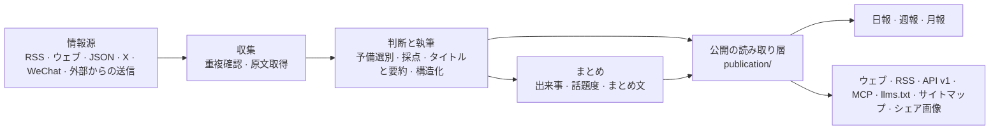

# アーキテクチャ



## 3 つのプロセス

| プロセス | 場所 | 役割 |
|---|---|---|
| api | `apps/api/` | Fastify。サイト自身が使うインターフェース（`/api/site/`）、公開 API（`/api/v1/`）、RSS、MCP、管理画面のインターフェース、画像プロキシ、シェア画像 |
| worker | `apps/worker/` | pg-boss の待ち行列と定期作業：情報源の取得、モデルの呼び出し、まとめ、話題度、日報、アラート、掃除 |
| web | `apps/web/` | React Router のサーバーサイドレンダリングのウェブ。HTTP で api を読むだけで、データベースには触れない |

業務のコードはすべて `packages/backend/` に、フロントエンドとバックエンドで共有する型と定数は `packages/contracts/` にあります。このサイト自身の名前・文言・ブランド・ページは `site/`、業界の分類・情報源・プロンプト・しきい値は `industry/`、このサイトだけの機能は `modules/`（下の「モジュール」）に置きます。

## 変わらない規則

- **公開の読み取り層は 1 つ**：ウェブ、RSS、API、MCP、サイトマップ、シェア画像が読むのはすべて `packages/backend/src/publication/` です。公開範囲、厳選の席（機械向けの出口では 1 つのニュースにつき 1 件だけ）、事実の証拠の条件は `publication/scope.ts` だけで定義します。新しい出口も、いまの取り下げと全文許可に従います。発行済みのレポートはその号の文章を保ちますが、引用を公開できるか、情報源の名前、引用の日時はいまの資料で判断し、取り下げではその引用に依存する導入文とカバーも外します。
- **キャッシュで古い内容を延命しない**：変わりうる内容はレスポンスの `Cache-Control` の期限で再検証し、サイトマップのプロセス・ディスク・HTTP のキャッシュは同じ締め切りを共有し、送信時に計り直しません。MCP の HTTP レスポンスは `no-store` を使います。自前のプロキシや CDN も同じく従ってください。設定の要件は [デプロイ](deploy.md) の更新の説明にあります。
- **ページはモデルを呼ばない**：読者がページを開いても、データベースにある結果を読むだけです。モデルは worker の作業の中でだけ呼びます。
- **お金のかかるリクエストには受領記録**：有料のリクエスト（モデル、X、WeChat、Jina）はまず受領記録を作り、結果を受け取ったら保存してから使います。プロセスの再起動や作業の再試行では、支払い済みの結果を再利用し、二重に支払いません（`providers/receipts.ts`）。結果不明の受領記録は 30 分を過ぎると自動で 1 回解放され、それで失敗のまま止まっていた記事は待ち行列に戻り、未完の本文抽出や分析を続けます。再び結果不明になったら、管理者が「実行」ページで確認してから解放します。
- **予算の遮断**：有料のサービスごとに 1 分・1 時間・1 日の上限があり、超えると止まります（管理画面の「設定 → 有料リクエストの上限」）。
- **安全弁**：`COLLECT_ENABLED`、`MODEL_CALLS_ENABLED`、`FEISHU_CONTENT_PUSH_ENABLED`、`FEISHU_INTERNAL_ENABLED`、`INDEXNOW_SUBMIT_ENABLED` は「外に出すかどうか」だけを決め、どのロジックを通るかは決めません。`true` にしたときだけ開きます。開発中は閉じておき、テストでは配信は常に閉じ、収集とモデルの呼び出しはローカルの偽サービスにだけつなぎます。
- **公開内容は匿名**：管理者と訪問者は同じものを見ます。読者のお気に入りや既読はブラウザに保存します。管理画面は管理者だけです。
- **古い記事で埋めない**：発見時に公開から 48 時間を過ぎた資料、新しい情報源の既存分、さかのぼった配信は、原文の日時で保管し、「今日」に入れず配信もしません。
- **出どころをたどれる**：厳選はすべて原文にリンクします。サイト内で全文を出すかは情報源の `site_fulltext` で決まり、既定では要約だけを表示します。
- **規則はその持ち主のモジュールが管理する**：管理画面は内容・出来事・通知・復旧のモジュールを呼び、それらの状態を直接書き換えません。業務のモジュールが管理画面に依存することもありません。手動の変更、公開の結果、復旧に必要な記録は一緒にコミットします。
- **プロセスをまたぐインターフェースは型を共有する**：管理画面のインターフェースは `packages/contracts/src/admin.ts`、作業のペイロードは `jobs/queue.ts` の `JobData` が正で、送る側と受ける側で一緒に検査します。フロントエンドはこれまでどおり HTTP でだけバックエンドにアクセスします。

これらのモジュールの境界は `tests/architecture.test.ts` が検査します。境界を変えるときは約束と検査を一緒に更新します。サイトの身元と各工程のモデルは `site/` から、業界の分類とプロンプトは `industry/` から読み、コードに特定のサイトの値を書き込みません。

## 言語とタイムゾーン

- **表示言語**：`site/site.ts` の `SITE.locale`（HTML の `lang`、`og:locale`、RSS の `<language>`）。画面の固定文言は日本語で書かれています。
- **読者の言語**：`SITE.language`（`ja` か `zh`）。モデルが書くタイトル・要約・翻訳の言語で、どの原文がすでにこの言語か（翻訳が要らないか）は [`packages/contracts/src/language.ts`](../packages/contracts/src/language.ts) で判定します。日本語はかなの有無、中国語は簡体字で見分けます。サイト内の翻訳はこの言語のコードで保存します（`translations.lang`）。
- **タイムゾーン**：`TIME_ZONE`（いまは `Asia/Tokyo`、`+09:00`）。日報の締め、画面の日付、定期作業、アラート、タイムゾーンのない日時の解釈がすべてこれを読みます（[`packages/contracts/src/time.ts`](../packages/contracts/src/time.ts) の `siteDate`・`siteAt` など）。夏時間のない固定のオフセットを書きます。

**将来の日中切り替えについて**：いまの作りは「1 つのサイトに 1 つの言語」です。日本語と中国語を切り替えられるようにするには、(1) 画面の固定文言を言語ごとの辞書に移す、(2) `industry/prompts/` を言語ごとに用意する、(3) モデルが書くタイトルと要約を言語ごとに保存する（データベースの変更と、モデルの呼び出しが言語の数だけ増える）、の 3 つが必要です。言語の判定、タイムゾーン、翻訳の保存先の言語コードはすでに設定から読むようにしてあるので、まずは (1) と (2) から始められます。

## ディレクトリ

| 場所 | 内容 |
|---|---|
| `site/` | このサイト自身のもの：サイト名と文言、各工程のモデル、ブランドとロゴ、規約のページ、そのまま公開するルートのファイル、更新履歴、有効にするモジュール（`site/modules/`） |
| `industry/` | 業界パック：分類タグ、トピック、示範の情報源、プロンプト、しきい値 |
| `modules/` | このサイトだけの機能。1 つの機能に 1 つのフォルダ（下の「モジュール」）。フレームワーク自体はモジュールを持たない |
| `packages/backend/src/sources/` | 6 種類の情報源の読み取り、取得のスケジュール（`collect.ts`） |
| `packages/backend/src/content/` | 資料の保存、重複確認、本文の抽出と整形 |
| `packages/backend/src/editorial/` | 判断と執筆：`analyze.ts`（流れ）、`prompts.ts`（プロンプトの読み込み）、`models.ts`（各工程のモデル） |
| `packages/backend/src/events/` | 出来事のまとめ、話題度、出来事のまとめ文 |
| `packages/backend/src/publication/` | 公開の読み取り層 |
| `packages/backend/src/reports/` | 日報、週報、月報 |
| `packages/backend/src/providers/` | モデル、ベクトル、X、WeChat、Jina の呼び出し、受領記録と予算 |
| `packages/backend/src/notify/` | 飛書への配信 |
| `packages/backend/src/operations/` | アラート、バックアップ、掃除、IndexNow |
| `packages/backend/src/admin/` | 管理画面のインターフェース |
| `apps/web/app/routes/` | 1 ページに 1 ファイル。`routes.ts` がルート表 |
| `database/migrations/` | データベースのマイグレーション。番号順に実行 |
| `scripts/` | 初期化、マイグレーション、シード、評価、検査のスクリプト |
| `tests/` | バックエンドのテスト（データベース名は `_test` か `_ci` で終わる必要がある。下を参照） |

## モジュール

フレームワークになく、このサイトだけに要る機能（専用のランキングや監視ページなど）はモジュールにします：1 つの機能に 1 つのフォルダ `modules/<名前>/` で、`@hotmoto/<名前>` という npm パッケージとして、自分のバックエンド、インターフェース、ページ、スタイル、マイグレーション、テストを持ちます。

| ファイル | 内容 |
|---|---|
| `module.ts` | アドレス：ページ、転送、api に処理を渡すパス（型は `packages/contracts/src/modules.ts`） |
| `server.ts` | バックエンドへの差し込み口：インターフェース、定期作業、待ち行列、イベントのコールバック、管理画面のデータなど（`packages/backend/src/modules.ts`。差し込み口ごとに読むファイルを明記） |
| `web.tsx` | ウェブへの差し込み口：ページ、ナビゲーション、トピックページと管理画面の部品など（`apps/web/app/modules.ts`）。特定のページにだけ出る部品は読み込み関数を渡し、そのページのコードと一緒に読み込む |
| `migrations/` | 自分のテーブル。`database/migrations/` と一緒にファイル名順で実行 |
| `tests/` | 自分のテスト。`npm test` で一緒に動く |

書き終えたら `site/modules/` の 3 つの一覧に載せます：`index.ts` にアドレス、`server.ts` にバックエンド、`web.ts` にウェブ（ないものは載せない）。さらに `site/package.json` の `dependencies` に書きます。Docker でデプロイするなら、`Dockerfile` にほかのパッケージにならって `COPY modules/<名前>/package.json modules/<名前>/` を 1 行加えます。フレームワークのコードはどのモジュールも import せず、この 3 つの一覧だけを読むので、元のリポジトリの更新を取り込むときも自分の機能と衝突しにくくなっています。差し込み口が足りないときは、その機能をフレームワークに書くのではなく、汎用の差し込み口をフレームワークに加えます。

## データベースのマイグレーション

公開済みのマイグレーションはデプロイの履歴で、書き換えたり消したりできません。修正は後のファイルに入れます。エンジンとモジュールのマイグレーションは同じ約束に従います。`0055` 以降、1 つのファイルにはオンラインで実行してよい文を 1 つだけ入れ、PR は約束に合わない新しいマイグレーションを拒否し、小さい番号で検査をすり抜けることも許しません。前の文がテーブルをロックした後、同じトランザクションでほかのテーブルを待ったり大量のデータを走査したりすることを避けるためです。

新しい列はできるだけ NULL 許容か定数の既定値にします。既存のテーブルに CHECK や外部キーを加えるときは、まず `NOT VALID` にし、別のマイグレーションで検証します。インデックスは単独の `CREATE INDEX CONCURRENTLY IF NOT EXISTS` を使います。公開するマイグレーションで大量の UPDATE、DELETE をしたり、DO でそれを隠したりしてはいけません。データの埋め戻しは、分割して観測できる別の操作にし、先にバックアップの複製で検証します。

複数の絞り込み条件に相関があって実行計画が行数をひどく少なく見積もるときは、それらの列に MCV の複合統計を作り、別のマイグレーションでそのテーブルのその列を `ANALYZE` してかまいません。先に実際の分布で効果を確かめ、根拠のない統計オブジェクトは増やさず、マイグレーションでデータベース全体を分析したり、ロックされたテーブルを飛ばして成功とみなしたりしません。

型の変更、テーブルや列の削除などの破壊的な変更は、更新と巻き戻しの手順を別に設計し、[デプロイ](deploy.md#更新) で既存データへの影響を説明します。いまのオンラインマイグレーションの検査はそのままでは通しません。許す文を増やすときは、それが稼働中のリクエストを長く止めないことを先に示し、対応する検査を加えます。検査を切ったり古い記録を書き換えたりしてはいけません。

## 公開の出口

| アドレス | 内容 |
|---|---|
| `/` `/all` `/hot` `/topics` `/daily` `/weekly` `/monthly` | 厳選、すべてのニュース、話題の出来事、トピック、日報・週報・月報 |
| `/feed.xml` `/feed/full.xml` `/feed/all.xml` `/feed/daily.xml` `/feed/weekly.xml` `/feed/monthly.xml` | RSS：厳選、厳選の全文、すべて、日報、週報、月報。カテゴリ別の `/feed/category/<key>.xml` もある |
| `/api/v1/` | 公開 API。ドキュメントは `/openapi-v1.json`。Agent 向けの Markdown は `/api/v1/agent` から。説明ページは `/agent` |
| `/api/mcp` | MCP サーバー：最新、検索、話題、出来事、日報、週報、月報のツールが 1 つずつ。ツール名の接頭辞は `site/site.ts` の `mcpPrefix` |
| `/llms.txt` `/sitemap.xml` `/robots.txt` | 大規模言語モデルと検索エンジン向けの説明（`robots.txt` などルートのファイルは `site/public/`） |
| `/admin` | 管理画面 |

## テスト

```bash
npm run typecheck
DATABASE_URL=postgres://127.0.0.1:5432/hotmoto_test npm test
npm run build -w @hotmoto/web && node --test apps/web/tests/*.test.ts
```

`DATABASE_URL` が指すデータベース名は `_test` か `_ci` で終わる必要があり、なければ自動で作成してマイグレーションします。テストファイルはそれぞれ自分の複製の上で並列に動くので、データベースのアカウントにはデータベースを作る権限（`CREATEDB`）が要ります。テストは外部のサービスに一切アクセスしません：モデルと有料のインターフェースはローカルの偽サービスが答えます。
